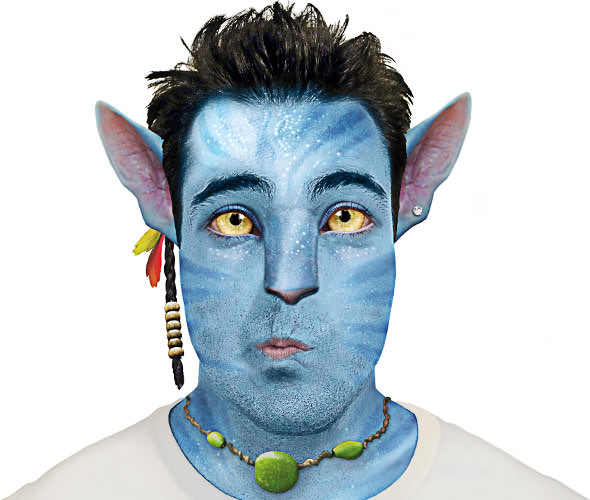
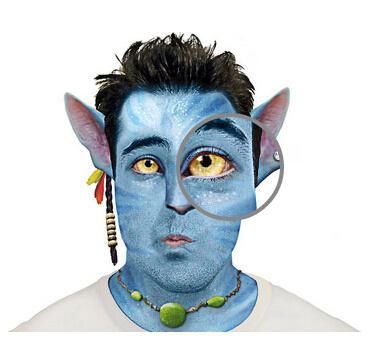
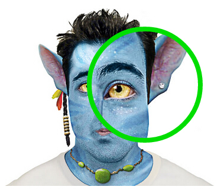
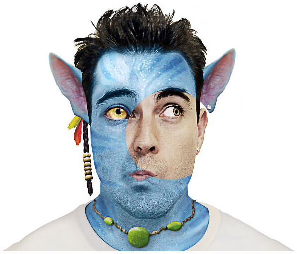

imageZoom
=========

一款jQuery放大镜插件，实现上参考了[imageLens](http://www.dailycoding.com/Posts/imagelens__a_jquery_plugin_for_lens_effect_image_zooming.aspx)，支持“撕页”效果。

##如何使用？
1. 加载jQuery
2. 加载本插件：jquery.imageZoom.js
3. 准备好一张图片

##实例
HTML

	

JS

	$('#zoom').imageZoom();

**注：img标签的width和height属性需设置成比图片的尺寸小，才能实现放大的效果。**

效果如下：

当然，你可以设置放大镜的大小和边框的大小、颜色：

JS

	$('#zoom').imageZoom({
        zoomSize: 180,
		borderSize: 8,
		borderColor: '#0d0'
	});

效果如下：

如果，你设置img标签的尺寸与图片**尺寸一致**，同时在配置中传入一张**与原图大小一致**的图片，那么就能实现“撕页”效果了。

HTML

	

JS

	$('#raw').imageZoom({
        zoomSize: 180,
		borderSize: 0,
		borderColor: '#fff',
		imageSrc: "raw.jpg"
	});

效果如下：

**注：IE8以下由于不支持CSS3的`border-radius`属性，放大镜将会展示成方形**

[查看demo](http://helloiamkitty.github.io/imageZoom/)